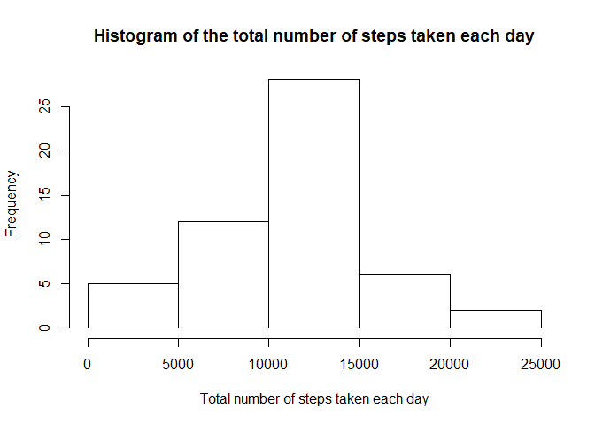
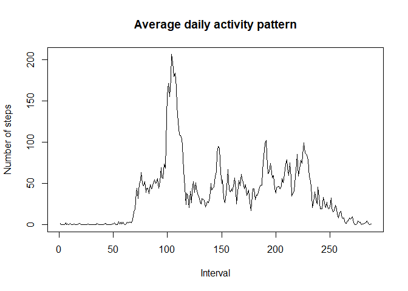
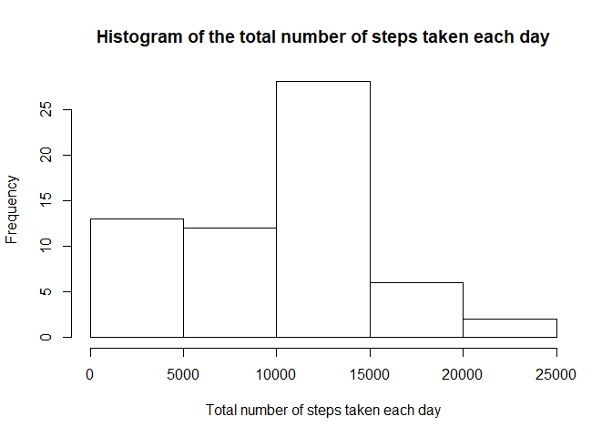
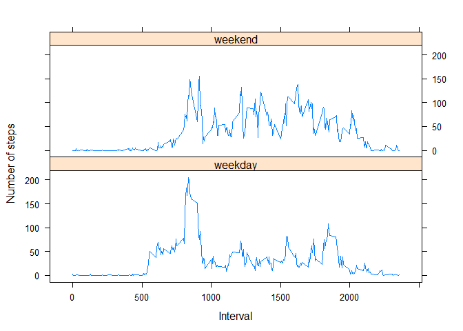

## Loading and preprocessing the data
Load data.

```r
ActivityData <- read.csv("activity.csv")
```

Convert date column to date class.

```r
ActivityData$date <- as.Date(as.character(ActivityData$date), "%Y-%m-%d")
```

## What is mean total number of steps taken per day?
Calculate the total number of steps per day.

```r
DaySum <- with(ActivityData, tapply(steps, date, sum))
```

Plot a histogram of the total number of steps taken each day.

```r
hist(DaySum, main = "Histogram of the total number of steps taken each day", xlab = "Total number of steps taken each day")
```

<!-- -->

Calculate the mean and the median of the total number of steps taken per day

```r
mean(DaySum, na.rm = TRUE)
```

```
## [1] 10766.19
```

```r
median(DaySum, na.rm = TRUE)
```

```
## [1] 10765
```

## What is the average daily activity pattern?
A time series plot of the 5-minute interval (x-axis) and the average number of steps taken in that interval averaged across all days (y-axis)

```r
IntSum <- with(ActivityData, tapply(steps, interval, mean, na.rm = TRUE))
plot(IntSum, type = "l", xlab = "Interval", ylab = "Number of steps", main = "Average daily activity pattern")
```

<!-- -->

Determine the 5 minute interval with the highest number of average steps.

```r
IntSum[which.max(IntSum)]
```

```
##      835 
## 206.1698
```

Activity peaks in the morning (8:30am).

## Imputing missing values
Determine how many missing values there are in the data.

```r
colSums(is.na(ActivityData))
```

```
##    steps     date interval 
##     2304        0        0
```

Replace the NAs with the median number of steps for that 5 minute interval.

```r
library(plyr)
stepdf <- ddply(ActivityData, .(interval), summarize, median = median(steps, na.rm = TRUE))
ActivityData2 <- merge(ActivityData, stepdf, by = "interval")
for(i in 1:nrow(ActivityData2)){
  if(is.na(ActivityData2[i,2])){
    ActivityData2[i,2] <- ActivityData2[i,4] 
  }
}
```

Calculate the total number of steps per day and plot a histogram of the total number of steps taken each day.

```r
ActSum2 <- with(ActivityData2, tapply(steps, date, sum))
hist(ActSum2, main = "Histogram of the total number of steps taken each day", xlab = "Total number of steps taken each day")
```

<!-- -->

```r
mean(ActSum2, na.rm = TRUE)
```

[1] 9503.869

```r
median(ActSum2, na.rm = TRUE)
```

[1] 10395

Imputing the missing values lowers the mean and median values for the total number of steps take each day.

## Are there differences in activity patterns between weekdays and weekends?
Create a new factor variable to show whether a date is a weekday or a weekend.

```r
library(dplyr)
```

```
## 
## Attaching package: 'dplyr'
```

```
## The following objects are masked from 'package:plyr':
## 
##     arrange, count, desc, failwith, id, mutate, rename, summarise,
##     summarize
```

```
## The following objects are masked from 'package:stats':
## 
##     filter, lag
```

```
## The following objects are masked from 'package:base':
## 
##     intersect, setdiff, setequal, union
```

```r
ActivityData3 <- mutate(ActivityData2, day = ifelse(grepl("Saturday|Sunday", weekdays(date)), "weekend", "weekday"))
ActivityData3$day <- as.factor(ActivityData3$day)
```

A panel plot consisting of time series plots of the 5-minute interval (x-axis) and the average number of steps taken across all weekday days or weekend days (y-axis). 

```r
sumday <- ddply(ActivityData3, .(interval, day), summarize, mean = mean(steps, na.rm = TRUE))
library(lattice)
xyplot(mean~interval|day, data = sumday, layout = c(1,2), type = "l", ylab = "Number of steps", xlab = "Interval")
```

<!-- -->

Weekend activity is spread throughout the day whereas weekday activity is concentrated around peak in the morning.
